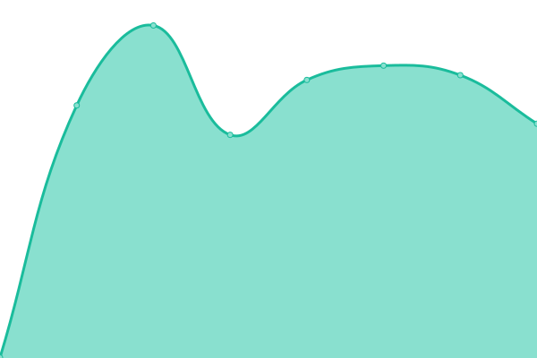
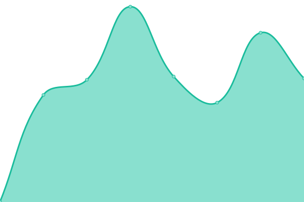
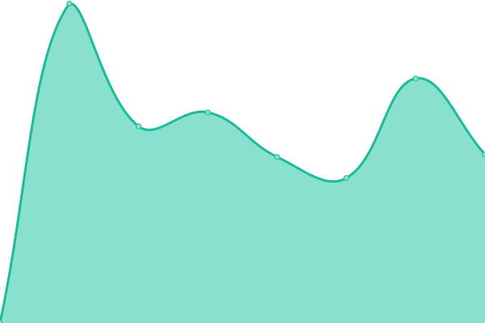
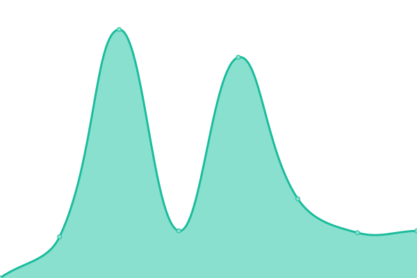
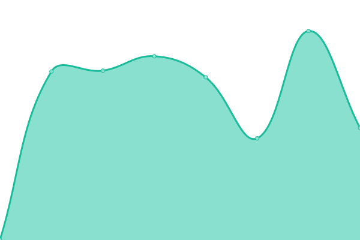

# [📈 Live Status](https://ASchmidt1024.github.io/uptime-akjs): <!--live status--> **🟩 All systems operational**

This repository contains the open-source uptime monitor and status page for [Alexander Schmidt](https://akjs.io), powered by [Upptime](https://github.com/upptime/upptime).

With [Upptime](https://upptime.js.org), you can get your own unlimited and free uptime monitor and status page, powered entirely by a GitHub repository. We use [Issues](https://github.com/ASchmidt1024/uptime-akjs/issues) as incident reports, [Actions](https://github.com/ASchmidt1024/uptime-akjs/actions) as uptime monitors, and [Pages](https://ASchmidt1024.github.io/uptime-akjs) for the status page.

<!--start: status pages-->
<!-- This summary is generated by Upptime (https://github.com/upptime/upptime) -->
<!-- Do not edit this manually, your changes will be overwritten -->
<!-- prettier-ignore -->
| URL | Status | History | Response Time | Uptime |
| --- | ------ | ------- | ------------- | ------ |
|  [akjs.io](https://akjs.io) | 🟩 Up | [akjs-io.yml](https://github.com/ASchmidt1024/uptime-akjs/commits/HEAD/history/akjs-io.yml) | 

 887ms
     
 | 

<a href="https://ASchmidt1024.github.io/uptime-akjs/history/akjs-io">100.00%</a>
    

|  [xrm.rocks](https://xmr.rocks) | 🟩 Up | [xrm-rocks.yml](https://github.com/ASchmidt1024/uptime-akjs/commits/HEAD/history/xrm-rocks.yml) | 

 530ms
     
 | 

<a href="https://ASchmidt1024.github.io/uptime-akjs/history/xrm-rocks">100.00%</a>
    

|  [pmnr.xrm.rocks](https://pmnr.xmr.rocks) | 🟩 Up | [pmnr-xrm-rocks.yml](https://github.com/ASchmidt1024/uptime-akjs/commits/HEAD/history/pmnr-xrm-rocks.yml) | 

 1079ms
     
 | 

<a href="https://ASchmidt1024.github.io/uptime-akjs/history/pmnr-xrm-rocks">100.00%</a>
    

|  [lookrativ.de](https://lookrativ.de) | 🟩 Up | [lookrativ-de.yml](https://github.com/ASchmidt1024/uptime-akjs/commits/HEAD/history/lookrativ-de.yml) | 

 982ms
     
 | 

<a href="https://ASchmidt1024.github.io/uptime-akjs/history/lookrativ-de">100.00%</a>
    

|  [kunst-kasten.de](https://kunst-kasten.de) | 🟩 Up | [kunst-kasten-de.yml](https://github.com/ASchmidt1024/uptime-akjs/commits/HEAD/history/kunst-kasten-de.yml) | 

 772ms
     
 | 

<a href="https://ASchmidt1024.github.io/uptime-akjs/history/kunst-kasten-de">100.00%</a>
    

<!--end: status pages-->

[**Visit our status website →**](https://ASchmidt1024.github.io/uptime-akjs)

## 📄 License

- Powered by: [Upptime](https://github.com/upptime/upptime)
- Code: [MIT](./LICENSE) © [Alexander Schmidt](https://akjs.io)
- Data in the `./history` directory: [Open Database License](https://opendatacommons.org/licenses/odbl/1-0/)
